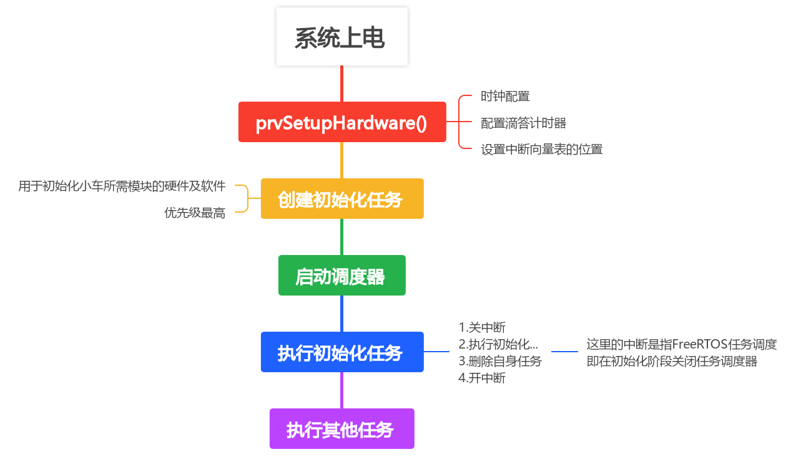
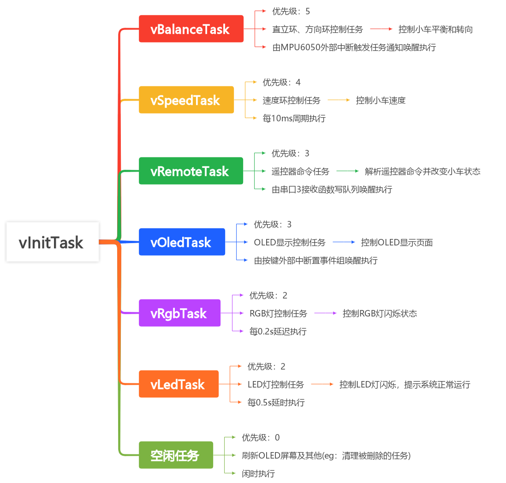
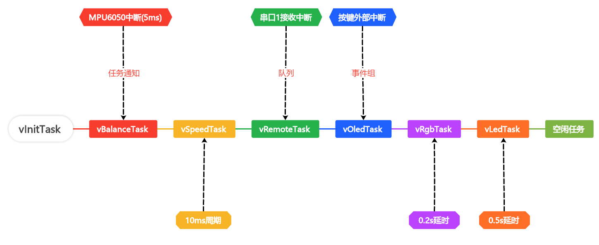
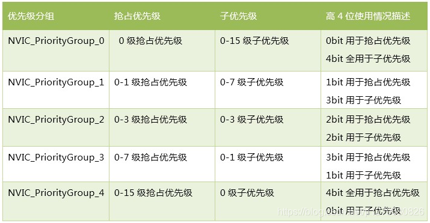
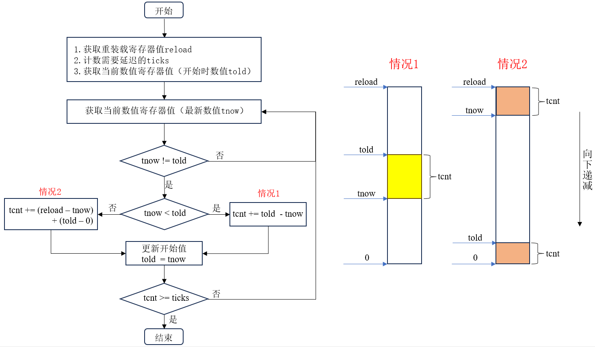

# Balance-car

本项目实现了两轮平衡小车，小车可利用遥控（安卓手机串口APP）进行操控（前后左右、灯光、蜂鸣器等）。该小车基于FreeRTOS，主控芯片采用STM32F103C8T6，其他模块包含：

- 一个MPU6050
- 一个OLED显示屏
- 两个蓝牙HC-05模块
- 两个直流减速电机（包含编码器）

PCB是采用Altium Designer设计的四层电路板，包含开关、稳压电路、按键、模块接口等，软件使用keil MDK开发。

# 系统流程



小车系统上电后，首先执行FreeRTOS自带的硬件启动函数，包括时钟、中断向量表的地址配置等，使得FreeRTOS可以运行起来。

本项目会先创建一个任务，然后启动调度器。该任务用于初始化小车的各个模块以及创建其他任务，该任务完成后，会自己把自己删掉，起到一个初始化的作用。

- 那为什么要这样做呢？

  - 因为在一些模块的初始化，需要用到延迟函数（例如OLED），然后FreeRTOS已经使用了滴答计时器，这个时候就不好像裸机系统一样利用滴答计时器来计算延迟

  - 虽然说可以使用其他定时器或者纯软件实现延迟函数，但是这毕竟是需要消耗一些资源的，对于资源紧张的MCU来说成本就会增加

  - 正好FreeRTOS自带了ms级任务延迟，所以可以使用 `vTaskDelay(pdMS_TO_TICKS(xxx ms))` 函数来实现ms级延迟

  - 但是利用任务来初始化时一定要注意在任务延迟时，后台会将任务阻塞，为了避免在初始化任务中发生任务调度，需要关闭FreeRTOS的任务调度器

  - 初始化任务服务函数如下：

    ```c
    /***************************************************************************
    *函  数：static void vInitTask(void *pvParameters)
    *功  能：初始化任务，用于初始化小车模块以及创建其他模块
    *参  数：pvParameters 为创建任务时所传递的参数
    *返回值：无
    ***************************************************************************/
    static void vInitTask(void *pvParameters)
    {
    	taskENTER_CRITICAL();	//关闭任务调度
    
    	BaseType_t xReturn;
    	vTaskDelay(pdMS_TO_TICKS( 500UL ));		//先延迟一段时间
    	
    	NVIC_PriorityGroupConfig( NVIC_PriorityGroup_2 ); //设置NVIC中断分组2:2位抢占优先级，2位响应优先级
    
    	/*	相关模块初始化	*/
    	Led_Init();             //=====初始化与 LED 连接的IO
    	Beep_Init();			//=====初始化与 蜂鸣器 连接的IO
    	Key_Init();				//=====按键初始化
    	Oled_Init();			//=====OLED初始化
    	Motor_Init();		    //=====初始化与电机连接的硬件IO接口
    	Encoder_Init();       	//=====初始化编码器A
    	Uart1_init(115200);	    //=====串口1初始化(用于HC-05蓝牙连接上位机显示波形)
    	Uart3_init(115200);     //=====串口3初始化(用于手机遥控)
    	Mpu6050_Init();			//=====MPU6050初始化
    	Key_EXTI_Init();		//=====按键中断初始化
    	MPU6050_EXTI_Init();	//=====MPU6050中断初始化
    	xReturn = Task_Init();	//-----创建其他任务
    	
    	if (xReturn != pdPASS)
    		// 进入这里代表其他任务创建失败
    		OLED_ShowString(0,8,(u8 *)"Task init fail",16);
    
    	vTaskDelete(NULL); 	// 删除自己
    
    	taskEXIT_CRITICAL();	//打开任务调度
    }
    ```

在初始化任务完成之后，系统就会开始调度其他任务进行执行。

# 小车任务



本项目一共创建了8个任务，下面将依次介绍：

- `vInitTask`：第一个创建的任务，用于小车各个模块初始化、中断初始化以及创建其他任务，该任务只执行一次，执行完毕后立马删除自身
- `vBalanceTask`：控制小车直立和方向，内部使用任务通知阻塞等待MPU6050外部中断，只有得到了任务通知，该任务才可以执行
- `vSpeedTask`：控制小车速度，周期性获取小车编码器数值，并计算速度环控制输出
- `vRemoteTask`：解析遥控器命令，内部使用队列读阻塞等待，当队列中没有数据时阻塞，有数据时才会执行，队列数据由串口接收服务函数（接收遥控器命令）写入
- `vOledTask`：控制OLED屏幕的显示页面，内部使用事件组阻塞等待，当没有事件发生时阻塞，其中某个时间发生才会执行。事件由两个按键中断函数发出，一个按键代表页面前翻，一个代表页面后翻，即切换页面
- `vRgbTask`：控制RGB灯的状态，延时循环执行，根据用户发送过来的状态切换RGB灯状态（例如：跑马灯、红、黄、闪烁）
- `vLedTask`：控制LED灯翻转，延时循环执行，示意小车正常运行
- 空闲任务：用于CPU闲时处理其他不很重要事情，例如清理已被删除的任务、OLED屏幕刷新

# 任务执行条件



# 中断优先级

本项目共用到了两类中断，5个中断：

- 串口1接收中断
- 串口3接收中断
- 按键1外部中断
- 按键2外部中断
- MPU6050数据外部中断

配置NVIC （NVIC的全称是Nested vectoredinterrupt controller，即嵌套向量中断控制器） 分组为 `NVIC_PriorityGroup_2` ，NVIC分组情况如下表所示：


本项目各中断优先级配置如下：

| 中断名              | 抢占优先级 | 子优先级 |
| ------------------- | ---------- | -------- |
| MPU6050数据外部中断 | 0          | 1        |
| 按键1外部中断       | 1          | 1        |
| 按键2外部中断       | 1          | 2        |
| 串口1接收中断       | 2          | 1        |
| 串口3接收中断       | 2          | 2        |

另外，对于系统中断（比如：PendSV，SVC，SysTick）等优先级的配置见[FreeRTOS优先级配置说明](https://blog.csdn.net/p1279030826/article/details/103141778)

# 遇到的问题

## MPU6050初始化

- 问题描述：

  - 在初始化MPU6050时，总是会初始化不成功，或者是使用DAP调试器单步调试才能初始化成功，一旦使用电池供电就初始化失败！

- 可能的原因：

  - IIC时序出现问题，因为STM32F103芯片的硬件IIC可能会出现问题，所以本项目使用的是软件IIC，在将信号翻转的过程中，可能需要微秒级延迟一会，但是并没有实现

- 解决办法——实现微秒级延迟，采用方法：

  1. 使用纯软件的方式实现，即在延迟函数中不断进行一定次数循环，以满足特定的延迟时间。但是这种方法需要计算出每个循环所需要的时间，不同单片机的时钟主频不一致很难进行移植，而且延迟不也精准，何况还可能在for循环期间被RTOS任务切换，导致时间更加不准确，故不推荐使用这种方法。

     ```c
     // 实现微秒级延时
     static void delay_us(uint32_t nus)
     {
         uint32_t i;
         uint32_t time = xxx;	//每次循环所占的时间
         nus = nus * time;
         for (i = 0; i < nus; i++) {
             // 做一些其他事
         }
     }
     ```

  2. 使用滴答定时器方式实现微秒级延迟，虽然FreeRTOS是利用滴答定时器实现系统时间以及任务切换等等，但是这并不妨碍我们利用滴答计时器实现微秒级延迟。

     > 参考：https://www.iotword.com/17662.html

     ```c
     // 实现微秒级延时(在这之前一定要保证滴答定时器已经初始化了)
     void delay_us(uint32_t nus)
     {
         uint32_t ticks;
         uint32_t told, tnow, reload, tcnt = 0;
     
         reload = SysTick->LOAD;                    // 获取重装载寄存器值
         ticks = nus * (SystemCoreClock / 1000000); // 计数时间值（即需要延迟的tick数）
         told = SysTick->VAL;                       // 获取当前数值寄存器值（开始时数值）
     
         while (1)
         {
             tnow = SysTick->VAL; // 获取当前数值寄存器值
             if (tnow != told)    // 当前值不等于开始值说明已在计数
             {
                 if (tnow < told) {        // 当前值小于开始数值，说明未计到0
                     tcnt += told - tnow; // 计数值=开始值-当前值
                 } else {                              // 当前值大于开始数值，说明已计到0并重新计数
                     tcnt += reload - tnow + told; // 计数值=重装载值-当前值+开始值  （已从开始值计到0）
                 }
     
                 told = tnow; // 更新开始值
                 if (tcnt >= ticks) {
                     break; // 时间超过/等于要延迟的时间,则退出.
                 }
             }
         }
     }
     
     ```

     

  3. 使用定时器实现微秒级延迟，这种方法其实与上面第二种方法类似，只不过是换了一种定时器，原理也相同：

     1. 首先计算出需要延迟的时间对应的ticks
     2. 然后重新装载寄存器值
     3. 在循环里不断判断是否超出时间，一旦超出，立即退出

## 外部中断

- 问题描述：

  - 在开发过程中，想要使用按键来操控OLED屏幕显示不同的界面以及调试PID，但是在FreeRTOS中原来的轮循的方式不太行，于是想到使用按键的外部中断来获取按键值，然后在按键外部中断中使用事件组更改相应按键标志位，但是又和MPU6050的外部中断引脚共用了同一个外部中断线（EXTI_Line5）

  - 在STM32F103系列中，外部中断的共用资源主要包括：

    1. 不同端口、同一pin口，共用一个中断线：如PA1、PB1、PC1共用外部中断线1——EXTI_Line1，但是不可以同时使用
    2. 不同pin口、同一端口：这个都不用说，PA1、PA2、PA3这些共用的是同一个端口寄存器之类的
    3. 同一pin口共用一个中断线，但16个中断线却只共用7个中断服务函数：其中中断线EXTI_Line0-4独立拥有一个中断服务，中断线5-9共用一个中断服务函数，中断线10-15共用一个中断服务函数

    > [stm32共用外部中断线问题](https://blog.csdn.net/m0_65346989/article/details/129588667?spm=1001.2101.3001.6650.3&utm_medium=distribute.pc_relevant.none-task-blog-2%7Edefault%7EBlogCommendFromBaidu%7ERate-3-129588667-blog-52995906.235%5Ev43%5Econtrol&depth_1-utm_source=distribute.pc_relevant.none-task-blog-2%7Edefault%7EBlogCommendFromBaidu%7ERate-3-129588667-blog-52995906.235%5Ev43%5Econtrol&utm_relevant_index=6)

  - 所以不可以同时使用 PA5(按键) 和 PB5(MPU6050) 来作为EXTI_Line5的外部中断

- 解决方案：

  - 只使用其中两个按键用于翻转OLED页面，去除原先的主页面，直接进入第一页面，然后根据按键切换上下页面
  - 至于PID等参数的调试，使用串口连接蓝牙，然后与手机连接，利用串口调试助手软件来更改PID的系数，以及控制小车

## 中断函数使用事件组

- 问题描述：

  - 这个问题是上面第二个问题的进一步延伸。使用其中两个按键来作为外部中断，一个按键按下表示OLED屏幕页面往前翻一页，另一个按键按下表示OLED屏幕往后翻一页
  - 为了更好地利用CPU，创建了一个空闲任务，在空闲任务不断刷新OLED屏幕，然后另外创建一个OLED控制任务，使用事件组来实现屏幕页面的切换
  - 当没有按键按下时，OLED屏幕控制任务处于阻塞态（即没有事件发生），当有时间发生时，判断是哪个事件（页面前翻或者后翻），根据事件类型来改变显示页面（改变函数指针）
  - 在按键中断中需要使用事件组发送事件，因为是外部中断属于ISR，所以需要使用 `xEventGroupSetBitsFromISR` 函数，但是编译的时候出现报错：未定义 `xTimerPendFunctionCallFromISR` 

- 解决方案：

  - 需要在 `FreeRTOSConfig.h` 定义以下：

    ```c
    #define INCLUDE_xEventGroupSetBitFromISR    1
    #define INCLUDE_xTimerPendFunctionCall  	1
    #define configUSE_TIMERS                	1
    ```

    
